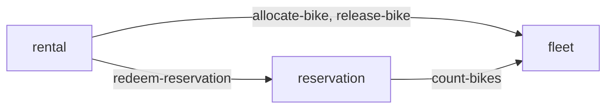

# 🚲 Amsterdam Bike Rental

Bike rental service for Amsterdam. Rents bikes and e-bikes from a curated fleet, known for the quality of the bikes and the ease of renting one.

Built with Quarkus and MicroProfile on the BCE architecture pattern: boundary-control-entity separation per business component, JAX-RS REST endpoints, CDI, MicroProfile-only dependencies, and system tests in a standalone module.

BCE-structured 👉 [bce.design](https://bce.design) | AI-assisted with 👉 [airails.dev](https://airails.dev)

<!-- sbce:generated:start — projection of the specs; do not edit; `apply` regenerates from the system doc + per-BC package docs -->
> Rent the nicest bikes and e-bikes in Amsterdam to walk-in and reserving customers, from pickup to return.

**Vision:** Renting a great bike in Amsterdam takes one minute and needs no explanation.

## Capabilities
- **fleet** — own the bikes and e-bikes of the Amsterdam fleet and know which of them can be rented right now · [`spec`](service/src/main/java/airhacks/qmp/fleet/package-info.java)
- **rental** — hand an available bike to a walk-in or reserving customer and settle the rental on return · [`spec`](service/src/main/java/airhacks/qmp/rental/package-info.java)
- **reservation** — hold a bike type for a customer's pickup day and hand it over exactly once · [`spec`](service/src/main/java/airhacks/qmp/reservation/package-info.java)

## Components
<!-- projection of the system doc's ## Components wiring; nodes = BCs, edges = declared calls; never inferred from code -->

<!-- sbce:generated:end -->

## Getting Started

See [AGENTS.md](AGENTS.md#build--test) for build, dev mode, and system test instructions.

## Modules

- [service](service/README.md) - Quarkus application module with BCE structure
- [service-st](service-st/README.md) - System tests for the service module

## [/sbce](https://sbce.space) Quickstart

Spec-driven BCE 👉 [sbce.space](https://sbce.space): one capability spec ≡ one business component. The spec lives in the BC's `package-info.java` and is the boundary contract; a green test run is the only definition of done. The `/sbce` skill and its companions are installed from 👉 [airails.dev](https://airails.dev).

```
/sbce new "let a customer rent an e-bike for a day"  # intent-level (PM/BA or dev): proposes the BC carving, confirm first
/sbce new rental                                     # structure-level (dev): the BC is already decided — authors the spec, scaffolds boundary/control/entity
/sbce apply rental                                   # converge: close the spec-vs-code gap until the test loop is green
```

- `new` writes the spec (boundary ops + [EARS](https://alistairmavin.com/ears/) requirements) — no business code yet.
- `apply` is idempotent: each boundary op becomes a boundary method, each requirement id (`R1.1`, …) a traceable test; code drift without a spec counterpart is surfaced, never absorbed.
