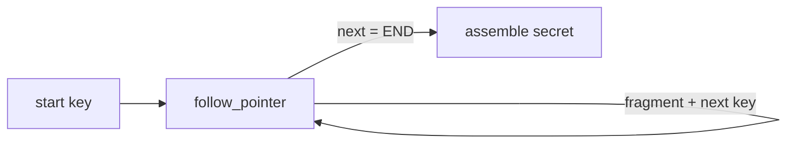
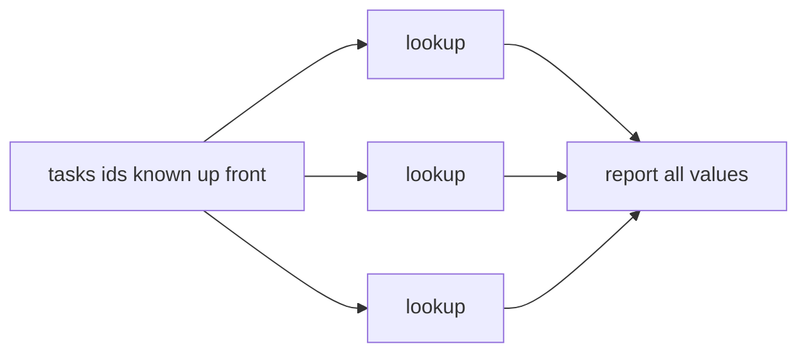

# Agent Benchmarks

Executable benchmarks that score an LLM-driven agent's tool-calling behavior against known,
seeded ground truth — no LLM judge. Each script builds a hidden task, runs a zsmith `Agent`
against it, and prints a one-line result. The benchmarks target **orthogonal axes** so their
results can disagree: a model can pass one and fail another.

## Prerequisites

Java 25+, and a built zsmith. The scripts load `../zsmith/zbo/zsmith.jar` and `lightmetal.jar`,
so build first from the `zsmith/` directory:

```
cd ../zsmith && zb.sh
```

Inference runs in-process through LightMetal (the local model configured for zsmith); no API
key is required.

## agentLoopBenchmark — pointer chasing (loop-following)

Measures stamina at a long, *serial* tool loop. The agent starts with one key and calls
`follow_pointer` repeatedly — each result reveals the next key plus one fragment of a secret —
until the terminal marker, then reassembles the fragments in order. Each hop's key is read from
the previous result, so the walk has a **serial data dependency**: it cannot be parallelized or
predicted, forcing an ordered loop of exactly `depth` calls. One skipped or reordered hop
corrupts the secret.



```
./agentLoopBenchmark         # default depth 50
for d in 10 25 50 100 200; do ./agentLoopBenchmark $d; done
```

```
PASS depth=50 toolCalls=50/50
FAIL depth=100 toolCalls=63/100 expected=... actual=...
```

`toolCalls=X/depth`: `X > depth` means the agent wandered or retried; `X < depth` means it
stopped early (often narrating or hallucinating hops instead of calling the tool). Both are
loop-following failures.

## agentParallelismBenchmark — parallel discrimination (independence)

The inverse axis. The agent is given `tasks` **independent** `id → value` pairs with every id
listed up front, so there is no data dependency. A `lookup` tool returns each value. An agent
that recognizes independence issues all calls in **one turn**; one that needlessly serializes
spreads them across `tasks` turns. The tool runs in parallel and gauges its own concurrency, so
the metric is **efficiency** (calls vs turns), not a correctness match — `correct=yes` is only a
gate confirming all lookups were actually performed.



```
./agentParallelismBenchmark        # default 8 independent lookups
for k in 4 8 16 32; do ./agentParallelismBenchmark $k; done
```

```
pd tasks=8 calls=8 turns=1 maxConcurrency=8 efficiency=8.0 correct=yes   # batched — ideal
pd tasks=8 calls=8 turns=8 maxConcurrency=1 efficiency=1.0 correct=yes   # serialized
```

`turns` near 1 with high `maxConcurrency` means the agent batched the independent calls;
`turns` near `tasks` with `maxConcurrency=1` means it serialized them. A model whose provider
never emits multiple tool calls per turn reads as fully serial — a valid result, not a bug.

## Reproducibility

Every task is seeded, so a given size reproduces across runs; model non-determinism is the only
variance. Running both benchmarks on the same model is the point: pointer chasing forbids
parallelism, parallel discrimination rewards it, so the pair reveals whether a model can
parallelize when allowed.
