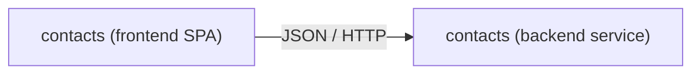

# contacts

Full-stack contacts management: create, browse, edit, and  contacts from a single-page frontend backed by a Java REST service. Both tiers follow the Boundary-Control-Entity (BCE) pattern with matching business components across the stack.

<!-- sbce:generated:start — projection of the specs; do not edit; `/sbce apply` regenerates from the system doc + per-BC package docs -->
> Manage personal contacts end to end: browse, find, create, edit, and delete them from the browser, backed by the contacts service.

**Vision:** Every contact one keystroke away — a contacts book that feels local, on a standards stack that outlives frameworks.

## Capabilities

- **contacts** (frontend) — own the contacts UI: a searchable, sortable listing with create, edit, and delete flows backed by the contacts service · [`spec`](frontend/app/src/contacts/package-info.md)
- **contacts** (backend) — own the contact lifecycle: validate, store, and serve contacts from an in-memory store · [`spec`](backend/service/src/main/java/airhacks/contacts/contacts/package-info.java)

## Components


<!-- sbce:generated:end -->

## Modules

- [frontend](frontend/) — standards-based SPA: custom elements with lit-html templating, unidirectional state management (`reduction.js`), routing via Navigation API + URLPattern. No build system, no framework; Playwright E2E tests.
- [backend](backend/) — MicroProfile service on Quarkus (Java 25) exposing contacts via JAX-RS. System tests live in the dedicated [service-st](backend/service-st/) module using MicroProfile REST Client.

## Prerequisites

Java 25+

## Run

Backend:

```
cd backend/service
./mvnw quarkus:dev
```

Frontend — serve `frontend/app/src` with any static server providing an `index.html` fallback, e.g.:

```
zws --dir frontend/app/src --single
```
