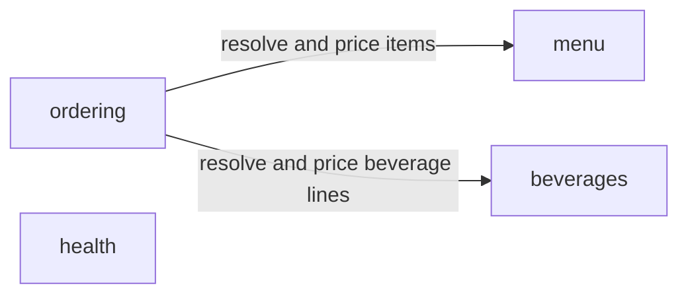

# 🍔 Hamburger

<!-- sbce:generated:start — projection of the specs; do not edit; `apply` regenerates from the system doc + per-BC package docs -->
> Let a customer order hamburgers from a fixed menu and receive a priced, confirmed order.

## Capabilities
- **beverages** — Expose the fixed set of beverages the shop sells, each with calories and a price in cents, so an order can resolve and price them. · [`spec`](service/src/main/java/airhacks/hamburger/beverages/package-info.java)
- **menu** — Expose the fixed set of hamburgers the shop sells, each with calories and a price in cents. · [`spec`](service/src/main/java/airhacks/hamburger/menu/package-info.java)
- **ordering** — Accept a customer's hamburger order, price it from the menu, and keep it retrievable. · [`spec`](service/src/main/java/airhacks/hamburger/ordering/package-info.java)

## Components
<!-- projection of the system doc's ## Components wiring; nodes = BCs, edges = declared calls/events; never inferred from code -->

<!-- sbce:generated:end -->

Quarkus MicroProfile service for selling hamburgers: customers browse the menu, compose a burger, place an order, and pay. Built on the BCE architecture pattern with boundary-control-entity separation, JAX-RS endpoints, CDI, MicroProfile-only dependencies, and System Tests in a standalone module.

BCE-structured 👉 [bce.design](https://bce.design) | AI-assisted with 👉 [airails.dev](https://airails.dev)

## Getting Started

See [AGENTS.md](AGENTS.md#build--test) for build, dev mode, and system test instructions.

## Modules

- [service](service/README.md) - Quarkus application module with BCE structure
- [service-st](service-st/README.md) - System tests for the service module

## [/sbce](https://sbce.space) Quickstart

Spec-driven BCE 👉 [sbce.space](https://sbce.space): one capability spec ≡ one business component. The spec lives in the BC's `package-info.java` and is the boundary contract; a green test run is the only definition of done. The `/sbce` skill and its companions are installed from 👉 [airails.dev](https://airails.dev).

```
/sbce new "let a customer order a hamburger"        # intent-level (PM/BA or dev): proposes the BC carving, confirm first
/sbce new menu                                      # structure-level (dev): the BC is already decided — authors the spec, scaffolds boundary/control/entity
/sbce apply menu                                    # converge: close the spec-vs-code gap until the test loop is green
```

- `new` writes the spec (boundary ops + [EARS](https://alistairmavin.com/ears/) requirements) — no business code yet.
- `apply` is idempotent: each boundary op becomes a boundary method, each requirement id (`R1.1`, …) a traceable test; code drift without a spec counterpart is surfaced, never absorbed.
