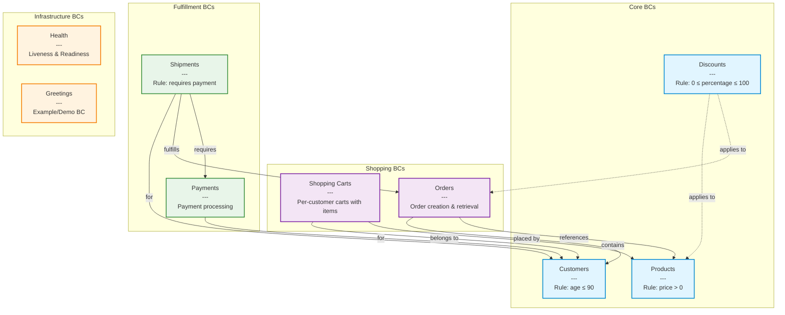

# Business Component Overview

This diagram shows the Business Components (BCs) in the ecommerce system and their relationships.

## Business Component Details

### Core BCs
- **Customers**: Customer management with age validation (max 90 years)
- **Products**: Product catalog with price validation (must be > 0)
- **Discounts**: Discount management with percentage validation (0-100%)

### Shopping BCs
- **Shopping Carts**: Per-customer shopping carts with line items
- **Orders**: Order creation and retrieval for customers

### Fulfillment BCs
- **Payments**: Payment processing associated with customers
- **Shipments**: Shipment management requiring payment validation

### Infrastructure BCs
- **Health**: Application health checks (liveness & readiness)
- **Greetings**: Example/demo business component

## Business Rules

Each BC enforces its own business rules through the `@Violation` annotation:

1. **Customers**: `customer age must not exceed 90`
2. **Products**: `product price must be greater than zero`
3. **Discounts**: `discount percentage must be between 0 and 100`
4. **Shipments**: `shipment requires existing payment for the customer`
