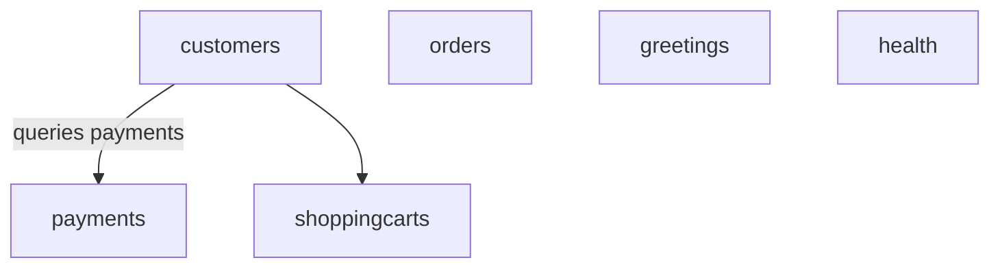

# service

E-commerce backend built with Quarkus 3.31 and MicroProfile, structured using the BCE (Boundary-Control-Entity) pattern. Each domain responsibility is a self-contained business component with JAX-RS boundaries, CDI-managed control logic, and Java record entities with JSON-P serialization.

## Business Components

- **customers** — customer registration and management, with age validation
- **orders** — order creation and retrieval
- **payments** — payment tracking per customer
- **shoppingcarts** — per-customer shopping carts with line items
- **greetings** — sample greeting endpoint
- **health** — liveness and readiness probes

## Prerequisites

Java 25+, Maven 3.9+

## Build and Run

```bash
mvn clean package
```

Development mode:

```bash
mvn quarkus:dev
```

Production:

```bash
java -jar target/quarkus-app/quarkus-run.jar
```

## Architecture


