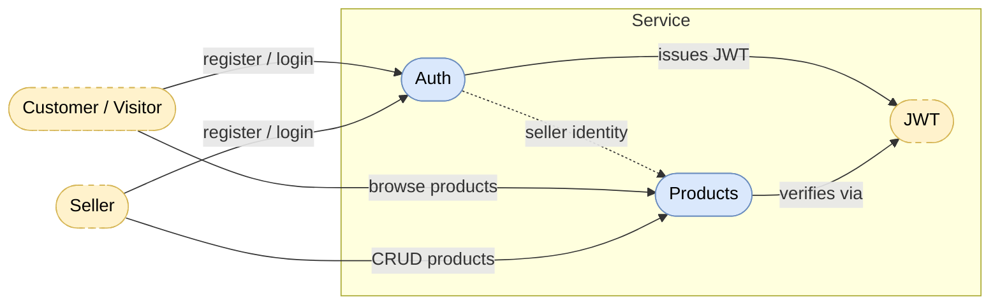

# service

Quarkus application module structured with the BCE (Boundary-Control-Entity) pattern. Business components organize code by domain responsibilities, with boundary layers for external interaction (JAX-RS resources), control for procedural logic, and entity for domain objects.

**Note:** "qmp" is a placeholder for the application name and should be replaced throughout the codebase with your actual application name.

## Business Component Interaction



## Build

```bash
mvn clean package
```

## Run

Development mode:

```bash
mvn quarkus:dev
```

Production build:

```bash
java -jar target/quarkus-app/quarkus-run.jar
```
