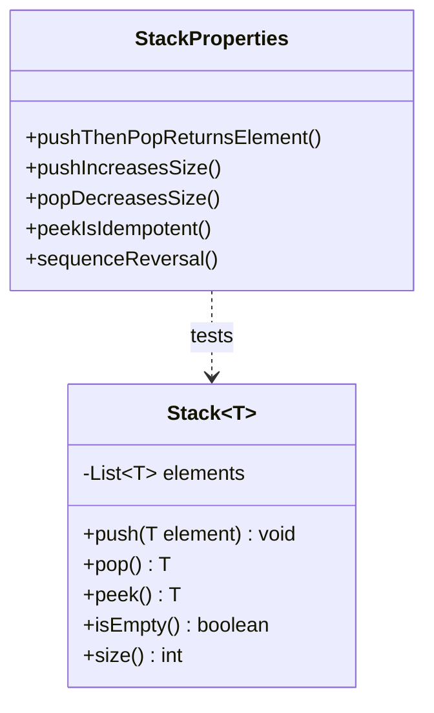

# Design Document: Stack PBT Demo

## Overview

This design describes a generic Stack<T> data structure implementation in Java 25, focused on demonstrating property-based testing (PBT) concepts using the jqwik library. The Stack follows the Last-In-First-Out (LIFO) principle and provides a minimal but complete API for stack operations.

The implementation prioritizes clarity and testability over performance optimization, making it an ideal candidate for demonstrating how property-based tests can verify correctness properties that would require many example-based tests to cover adequately.

## Architecture

The architecture follows a simple single-class design with clear separation between the data structure implementation and its property-based tests.



### Package Structure

```
airhacks/
├── stack/
│   └── entity/
│       └── Stack.java
└── stack/
    └── StackProperties.java (test)
```

## Components and Interfaces

### Stack<T> Entity

The Stack is implemented as a generic class using an internal ArrayList for element storage. This provides O(1) amortized time complexity for push and pop operations.

```java
public class Stack<T> {
    
    private final List<T> elements = new ArrayList<>();
    
    public void push(T element) {
        elements.addLast(element);
    }
    
    public T pop() {
        if (isEmpty()) {
            throw new EmptyStackException();
        }
        return elements.removeLast();
    }
    
    public T peek() {
        if (isEmpty()) {
            throw new EmptyStackException();
        }
        return elements.getLast();
    }
    
    public boolean isEmpty() {
        return elements.isEmpty();
    }
    
    public int size() {
        return elements.size();
    }
}
```

### EmptyStackException

A custom unchecked exception for operations on empty stacks:

```java
public class EmptyStackException extends RuntimeException {
    public EmptyStackException() {
        super("Cannot perform operation on empty stack");
    }
}
```

## Data Models

### Stack Internal State

The Stack maintains a single internal state:

| Field | Type | Description |
|-------|------|-------------|
| elements | List<T> | Ordered collection storing stack elements, with the last element being the top |

### Invariants

The Stack maintains these invariants at all times:
- `size() >= 0` (non-negative size)
- `isEmpty() == (size() == 0)` (consistency between isEmpty and size)
- After `push(x)`, `peek() == x` (top element is the last pushed)
- After `push(x); pop()`, the stack returns to its previous state


## Correctness Properties

*A property is a characteristic or behavior that should hold true across all valid executions of a system—essentially, a formal statement about what the system should do. Properties serve as the bridge between human-readable specifications and machine-verifiable correctness guarantees.*

Based on the prework analysis, the following properties have been consolidated to eliminate redundancy while ensuring comprehensive coverage:

### Property 1: Push-Pop Round Trip (LIFO)

*For any* Stack and *for any* element of type T, pushing the element onto the Stack and then immediately popping should return that exact same element.

This is the fundamental LIFO property that defines stack behavior. It verifies that the stack correctly maintains the "last in, first out" ordering.

**Validates: Requirements 2.4, 1.2**

### Property 2: Size Consistency

*For any* Stack with initial size N:
- After pushing one element, size should equal N + 1
- After popping one element (from non-empty stack), size should equal N - 1
- After pushing K elements onto an empty stack, size should equal K

This property ensures the size operation accurately reflects the number of elements and that push/pop correctly modify the count.

**Validates: Requirements 1.1, 2.2, 5.2, 5.3**

### Property 3: Peek Idempotence (Non-Destructive)

*For any* non-empty Stack:
- Calling peek() multiple times consecutively should return the same element
- Calling peek() should not change the stack's size
- peek() should return the same value that a subsequent pop() would return

This property verifies that peek is a pure observation operation with no side effects.

**Validates: Requirements 3.1, 3.2, 3.3**

### Property 4: Sequence Reversal

*For any* list of N elements pushed onto an empty Stack, popping all N elements should return them in reverse order of insertion.

This is the comprehensive LIFO ordering property that verifies the stack correctly reverses sequences.

**Validates: Requirements 6.1, 1.3**

### Property 5: Empty After Equal Push/Pop Count

*For any* empty Stack and *for any* sequence of N elements, pushing all N elements and then popping N times should result in an empty stack.

This property verifies that push and pop are inverse operations with respect to stack emptiness.

**Validates: Requirements 6.2, 4.3**

### Property 6: Non-Empty After Push

*For any* Stack (empty or non-empty) and *for any* element, after pushing the element, isEmpty() should return false.

This property ensures that a stack with at least one element is never reported as empty.

**Validates: Requirements 4.2**

## Error Handling

### EmptyStackException

Operations that require elements (pop, peek) throw `EmptyStackException` when called on an empty stack:

| Operation | Precondition | Exception |
|-----------|--------------|-----------|
| pop() | Stack is empty | EmptyStackException |
| peek() | Stack is empty | EmptyStackException |

The exception is an unchecked `RuntimeException` subclass, following Java best practices for programming errors that indicate misuse of the API.

### Null Elements

The Stack accepts null elements. This is a design choice to keep the implementation simple and generic. If null rejection is needed, it should be handled at a higher level.

## Testing Strategy

### Dual Testing Approach

This feature uses both unit tests and property-based tests as complementary verification methods:

- **Unit tests**: Verify specific examples, edge cases (empty stack operations), and error conditions
- **Property tests**: Verify universal properties across randomly generated inputs using jqwik

### Property-Based Testing with jqwik

jqwik is the chosen property-based testing framework for Java. It integrates with JUnit 5 and provides:
- Arbitrary generators for random test data
- Shrinking to find minimal failing examples
- Reproducible test runs with seed values

**Configuration Requirements**:
- Each property test runs minimum 100 iterations (jqwik default is 1000)
- Each property test is tagged with a comment referencing the design property
- Format: `// Feature: stack-pbt-demo, Property N: [property description]`

### Test Structure

```
src/test/java/airhacks/stack/
├── StackTest.java           # Unit tests for edge cases
└── StackProperties.java     # Property-based tests
```

### Unit Test Coverage

Unit tests focus on:
- New stack is empty (example for 4.1, 5.1)
- Pop on empty stack throws EmptyStackException (edge case for 2.3)
- Peek on empty stack throws EmptyStackException (edge case for 3.4)

### Property Test Coverage

Each correctness property maps to a single property-based test:

| Property | Test Method | Iterations |
|----------|-------------|------------|
| Property 1: Push-Pop Round Trip | pushThenPopReturnsElement | 100+ |
| Property 2: Size Consistency | pushAndPopMaintainCorrectSize | 100+ |
| Property 3: Peek Idempotence | peekIsIdempotent | 100+ |
| Property 4: Sequence Reversal | sequenceIsReversedOnPop | 100+ |
| Property 5: Empty After Equal Push/Pop | emptyAfterEqualPushPop | 100+ |
| Property 6: Non-Empty After Push | nonEmptyAfterPush | 100+ |

### jqwik Dependency

Add to pom.xml:
```xml
<dependency>
    <groupId>net.jqwik</groupId>
    <artifactId>jqwik</artifactId>
    <version>1.9.2</version>
    <scope>test</scope>
</dependency>
```
