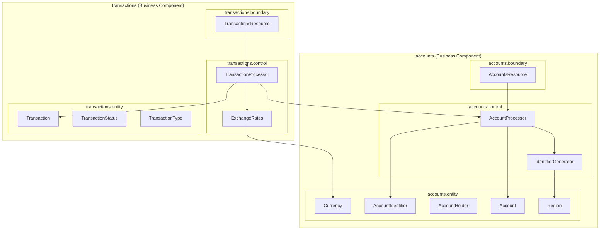

# Design Document: Account Management

## Overview

The Account Management component provides core banking functionality for a global ebanking application. It follows the Boundary-Control-Entity (BCE) architectural pattern established in the project, with JAX-RS resources exposing RESTful APIs, control classes handling business logic, and entity records representing domain objects.

The component supports multiple regional account identification systems (IBAN, IFSC, US routing numbers) and multi-currency operations with exchange rate conversion.

## Architecture



### BCE Package Structure

The account management feature is split into two business components following single responsibility:

```
airhacks.qmp.accounts
├── boundary/
│   └── AccountsResource.java      # JAX-RS resource for account lifecycle
├── control/
│   ├── AccountProcessor.java      # Account business logic
│   └── IdentifierGenerator.java   # Region-specific identifier generation
└── entity/
    ├── Account.java               # Account record
    ├── AccountHolder.java         # Account holder record
    ├── AccountIdentifier.java     # Sealed interface for region-specific identifiers
    ├── Currency.java              # Supported currencies enum
    └── Region.java                # Geographic regions enum

airhacks.qmp.transactions
├── boundary/
│   └── TransactionsResource.java  # JAX-RS resource for financial operations
├── control/
│   ├── TransactionProcessor.java  # Transaction business logic
│   └── ExchangeRates.java         # Currency conversion logic
└── entity/
    ├── Transaction.java           # Transaction record
    ├── TransactionType.java       # Transaction types enum
    └── TransactionStatus.java     # Transaction status enum
```

**Rationale for separation:**
- **accounts**: Manages account lifecycle (create, retrieve, close) - identity and state
- **transactions**: Manages financial operations (deposit, withdraw, transfer) - behavior and history

The TransactionProcessor depends on AccountProcessor to access and modify account balances.

## Components and Interfaces

### Boundary Layer

#### AccountsResource

JAX-RS resource exposing account management endpoints.

```java
@Path("accounts")
@ApplicationScoped
@Consumes(MediaType.APPLICATION_JSON)
@Produces(MediaType.APPLICATION_JSON)
public class AccountsResource {
    
    @Inject
    AccountProcessor accountProcessor;
    
    @POST
    Response createAccount(JsonObject request);
    
    @GET
    @Path("{id}")
    Response account(@PathParam("id") String accountId);
    
    @GET
    @Path("holder/{holderId}")
    Response accountsByHolder(@PathParam("holderId") String holderId);
    
    @DELETE
    @Path("{id}")
    Response closeAccount(@PathParam("id") String accountId);
}
```

#### TransactionsResource

JAX-RS resource exposing transaction endpoints.

```java
@Path("transactions")
@ApplicationScoped
@Consumes(MediaType.APPLICATION_JSON)
@Produces(MediaType.APPLICATION_JSON)
public class TransactionsResource {
    
    @Inject
    TransactionProcessor transactionProcessor;
    
    @POST
    @Path("deposit")
    Response deposit(JsonObject request);
    
    @POST
    @Path("withdraw")
    Response withdraw(JsonObject request);
    
    @POST
    @Path("transfer")
    Response transfer(JsonObject request);
    
    @GET
    @Path("account/{accountId}")
    Response transactionHistory(
        @PathParam("accountId") String accountId,
        @QueryParam("from") String fromDate,
        @QueryParam("to") String toDate);
}
```

### Control Layer

#### AccountProcessor

Handles account lifecycle operations.

```java
@ApplicationScoped
public class AccountProcessor {
    
    @Inject
    IdentifierGenerator identifierGenerator;
    
    Account create(AccountHolder holder, Currency currency, Region region);
    
    Optional<Account> find(String accountId);
    
    List<Account> findByHolder(String holderId);
    
    Account close(String accountId);
    
    Account updateBalance(String accountId, BigDecimal newBalance);
}
```

#### TransactionProcessor

Handles financial transactions with atomicity guarantees.

```java
@ApplicationScoped
public class TransactionProcessor {
    
    @Inject
    AccountProcessor accountProcessor;
    
    @Inject
    ExchangeRates exchangeRates;
    
    Transaction deposit(String accountId, BigDecimal amount, Currency currency);
    
    Transaction withdraw(String accountId, BigDecimal amount);
    
    TransferResult transfer(String sourceId, String destinationId, BigDecimal amount);
    
    List<Transaction> history(String accountId, LocalDate from, LocalDate to);
}
```

#### IdentifierGenerator

Generates region-specific account identifiers.

```java
interface IdentifierGenerator {
    
    static AccountIdentifier generate(Region region, String bankCode);
    
    static IbanIdentifier generateIban(String countryCode, String bankCode);
    
    static IndiaIdentifier generateIndiaIdentifier(String ifscCode);
    
    static UsIdentifier generateUsIdentifier(String routingNumber);
}
```

#### ExchangeRates

Provides currency conversion functionality.

```java
interface ExchangeRates {
    
    static BigDecimal convert(BigDecimal amount, Currency from, Currency to);
    
    static BigDecimal rate(Currency from, Currency to);
    
    static boolean isSupported(Currency currency);
}
```

### Entity Layer

#### Account

```java
public record Account(
    String id,
    AccountIdentifier identifier,
    AccountHolder holder,
    Currency currency,
    Region region,
    BigDecimal balance,
    String swiftBic,
    boolean closed,
    Instant createdAt
) {
    public Account {
        if (balance.compareTo(BigDecimal.ZERO) < 0) {
            throw new IllegalArgumentException("Balance cannot be negative");
        }
    }
    
    static Account create(AccountHolder holder, Currency currency, Region region, 
                          AccountIdentifier identifier, String swiftBic);
    
    Account withBalance(BigDecimal newBalance);
    
    Account asClosed();
    
    JsonObject toJson();
    
    static Account fromJson(JsonObject json);
}
```

#### AccountHolder

```java
public record AccountHolder(
    String id,
    String name,
    String email,
    String address
) {
    public AccountHolder {
        if (name == null || name.isBlank()) {
            throw new IllegalArgumentException("Holder name is required");
        }
    }
    
    JsonObject toJson();
    
    static AccountHolder fromJson(JsonObject json);
}
```

#### AccountIdentifier (Sealed Interface)

```java
public sealed interface AccountIdentifier 
    permits IbanIdentifier, IndiaIdentifier, UsIdentifier, AsiaPacificIdentifier {
    
    String value();
    
    Region region();
    
    JsonObject toJson();
}

public record IbanIdentifier(String iban) implements AccountIdentifier {
    public String value() { return iban; }
    public Region region() { return Region.EUROPE; }
}

public record IndiaIdentifier(String accountNumber, String ifscCode) implements AccountIdentifier {
    public String value() { return accountNumber; }
    public Region region() { return Region.INDIA; }
}

public record UsIdentifier(String accountNumber, String routingNumber) implements AccountIdentifier {
    public String value() { return accountNumber; }
    public Region region() { return Region.US; }
}

public record AsiaPacificIdentifier(String accountNumber, String bankCode) implements AccountIdentifier {
    public String value() { return accountNumber; }
    public Region region() { return Region.ASIA_PACIFIC; }
}
```

#### Transaction

```java
public record Transaction(
    String id,
    String accountId,
    TransactionType type,
    BigDecimal amount,
    Currency currency,
    BigDecimal balanceAfter,
    String referenceNumber,
    String relatedAccountId,
    TransactionStatus status,
    Instant timestamp
) {
    JsonObject toJson();
    
    static Transaction fromJson(JsonObject json);
}
```

#### Enums

```java
public enum Currency {
    USD, EUR, GBP, JPY, CHF, CAD, AUD, CNY, INR, SGD
}

public enum Region {
    EUROPE, INDIA, US, ASIA_PACIFIC
}

public enum TransactionType {
    DEPOSIT, WITHDRAWAL, TRANSFER_IN, TRANSFER_OUT
}

public enum TransactionStatus {
    COMPLETED, FAILED, PENDING
}
```

## Data Models

### Account JSON Structure

```json
{
    "id": "acc-uuid-12345",
    "identifier": {
        "type": "IBAN",
        "iban": "DE89370400440532013000"
    },
    "holder": {
        "id": "holder-uuid-789",
        "name": "John Doe",
        "email": "john@example.com",
        "address": "123 Main St, Berlin"
    },
    "currency": "EUR",
    "region": "EUROPE",
    "balance": 1000.00,
    "swiftBic": "COBADEFFXXX",
    "closed": false,
    "createdAt": "2024-01-15T10:30:00Z"
}
```

### Transaction JSON Structure

```json
{
    "id": "txn-uuid-67890",
    "accountId": "acc-uuid-12345",
    "type": "DEPOSIT",
    "amount": 500.00,
    "currency": "EUR",
    "balanceAfter": 1500.00,
    "referenceNumber": "REF-2024-001",
    "relatedAccountId": null,
    "status": "COMPLETED",
    "timestamp": "2024-01-15T14:22:00Z"
}
```

### Transfer Request JSON

```json
{
    "sourceAccountId": "acc-uuid-12345",
    "destinationAccountId": "acc-uuid-67890",
    "amount": 200.00
}
```

### API Endpoints Summary

| Method | Path | Description |
|--------|------|-------------|
| POST | /accounts | Create new account |
| GET | /accounts/{id} | Get account by ID |
| GET | /accounts/holder/{holderId} | Get accounts by holder |
| DELETE | /accounts/{id} | Close account |
| POST | /transactions/deposit | Deposit funds |
| POST | /transactions/withdraw | Withdraw funds |
| POST | /transactions/transfer | Transfer between accounts |
| GET | /transactions/account/{id} | Get transaction history |


## Correctness Properties

*A property is a characteristic or behavior that should hold true across all valid executions of a system—essentially, a formal statement about what the system should do. Properties serve as the bridge between human-readable specifications and machine-verifiable correctness guarantees.*

### Property 1: Account Creation Produces Zero-Balance Account

*For any* valid holder information, supported currency, and region combination, creating an account SHALL produce an account with zero balance and the correct region-specific identifier type.

**Validates: Requirements 1.1**

### Property 2: Invalid Currency Rejection

*For any* currency code not in the supported set (USD, EUR, GBP, JPY, CHF, CAD, AUD, CNY, INR, SGD), account creation SHALL be rejected with a descriptive error.

**Validates: Requirements 1.2**

### Property 3: Missing Holder Information Rejection

*For any* account creation request with missing or blank holder name, the request SHALL be rejected with validation errors.

**Validates: Requirements 1.3**

### Property 4: Region-Specific Identifier Generation

*For any* region, creating multiple accounts SHALL generate unique identifiers in the correct format:
- EUROPE: Valid IBAN (ISO 13616)
- INDIA: Unique account number with valid IFSC
- US: Unique account number with routing number
- ASIA_PACIFIC: Unique account number with bank code

**Validates: Requirements 1.4, 1.5, 1.6**

### Property 5: SWIFT_BIC Presence Invariant

*For any* created account regardless of region, the account SHALL have a non-null SWIFT_BIC code.

**Validates: Requirements 1.7**

### Property 6: Account Retrieval Round-Trip

*For any* created account, retrieving it by its identifier SHALL return an account with identical holder, currency, region, balance, and identifier values.

**Validates: Requirements 2.1**

### Property 7: Non-Existent Account Returns Not-Found

*For any* account identifier that does not exist in the system, retrieval or transaction history requests SHALL return a not-found error.

**Validates: Requirements 2.2, 6.3**

### Property 8: Holder Account List Completeness

*For any* holder with N accounts, querying accounts by holder ID SHALL return exactly N accounts, all belonging to that holder.

**Validates: Requirements 2.3**

### Property 9: Deposit Increases Balance

*For any* existing account with balance B and any positive amount A, depositing A SHALL result in balance B + A.

**Validates: Requirements 3.1**

### Property 10: Invalid Amount Rejection

*For any* deposit or withdrawal with amount ≤ 0, the transaction SHALL be rejected and account balance SHALL remain unchanged.

**Validates: Requirements 3.2, 4.3**

### Property 11: Cross-Currency Deposit Conversion

*For any* deposit where deposit currency differs from account currency, the credited amount SHALL equal the deposit amount multiplied by the exchange rate from deposit currency to account currency.

**Validates: Requirements 3.3**

### Property 12: Transaction Recording

*For any* completed deposit or withdrawal, a transaction record SHALL exist with non-null timestamp and reference number.

**Validates: Requirements 3.4, 4.4**

### Property 13: Withdrawal Decreases Balance

*For any* existing account with balance B and any positive amount A where A ≤ B, withdrawing A SHALL result in balance B - A.

**Validates: Requirements 4.1**

### Property 14: Insufficient Funds Rejection

*For any* withdrawal where amount exceeds available balance, the transaction SHALL be rejected and account balance SHALL remain unchanged.

**Validates: Requirements 4.2**

### Property 15: Transfer Atomicity

*For any* transfer between two accounts where source has sufficient balance, the source balance SHALL decrease by the transfer amount AND the destination balance SHALL increase by the converted amount (same currency) or exchange-rate-converted amount (different currencies).

**Validates: Requirements 5.1**

### Property 16: Failed Transfer Leaves Accounts Unchanged

*For any* transfer that is rejected (insufficient funds) or fails, both source and destination account balances SHALL remain at their pre-transfer values.

**Validates: Requirements 5.2, 5.5**

### Property 17: Cross-Currency Transfer Conversion

*For any* transfer between accounts with different currencies, the destination credit amount SHALL equal the source debit amount multiplied by the exchange rate.

**Validates: Requirements 5.3**

### Property 18: Transfer Creates Matching Reference Transactions

*For any* completed transfer, both source and destination accounts SHALL have transaction records with identical reference numbers.

**Validates: Requirements 5.4**

### Property 19: Transaction History Ordering

*For any* account with multiple transactions, the transaction history SHALL be ordered by timestamp descending (newest first).

**Validates: Requirements 6.1**

### Property 20: Transaction History Date Filtering

*For any* date range filter applied to transaction history, all returned transactions SHALL have timestamps within the specified range, and no transactions outside the range SHALL be returned.

**Validates: Requirements 6.2**

### Property 21: Currency Conversion Accuracy

*For any* currency conversion operation, the converted amount SHALL equal the source amount multiplied by the exchange rate between the two currencies.

**Validates: Requirements 7.2**

### Property 22: Zero-Balance Account Closure

*For any* account with zero balance, closure SHALL succeed and the account SHALL be marked as closed.

**Validates: Requirements 8.1**

### Property 23: Non-Zero Balance Closure Rejection

*For any* account with balance > 0, closure SHALL be rejected with remaining balance error and the account SHALL remain open.

**Validates: Requirements 8.2**

### Property 24: Closed Account Operation Rejection

*For any* closed account, all operations (deposit, withdraw, transfer) SHALL be rejected with account closed error.

**Validates: Requirements 8.3**

## Error Handling

### HTTP Status Codes

| Scenario | Status Code | Response |
|----------|-------------|----------|
| Successful creation | 201 Created | Account JSON |
| Successful retrieval | 200 OK | Account/Transaction JSON |
| Successful operation | 200 OK | Transaction JSON |
| Account not found | 404 Not Found | Error message |
| Validation error | 400 Bad Request | Validation errors |
| Unsupported currency | 400 Bad Request | Error message |
| Insufficient funds | 400 Bad Request | Error message |
| Account closed | 400 Bad Request | Error message |
| Non-zero balance closure | 400 Bad Request | Error message |
| Exchange rate unavailable | 503 Service Unavailable | Error message |

### Exception Hierarchy

```java
// Base exception for account operations
public class AccountException extends WebApplicationException {
    public AccountException(String message, Response.Status status) {
        super(message, status);
    }
}

// Specific exceptions
public class AccountNotFoundException extends AccountException {
    public AccountNotFoundException(String accountId) {
        super("Account not found: " + accountId, Response.Status.NOT_FOUND);
    }
}

public class InsufficientFundsException extends AccountException {
    public InsufficientFundsException(BigDecimal requested, BigDecimal available) {
        super("Insufficient funds: requested " + requested + ", available " + available, 
              Response.Status.BAD_REQUEST);
    }
}

public class AccountClosedException extends AccountException {
    public AccountClosedException(String accountId) {
        super("Account is closed: " + accountId, Response.Status.BAD_REQUEST);
    }
}

public class InvalidAmountException extends AccountException {
    public InvalidAmountException(BigDecimal amount) {
        super("Invalid amount: " + amount + ". Amount must be positive.", 
              Response.Status.BAD_REQUEST);
    }
}

public class UnsupportedCurrencyException extends AccountException {
    public UnsupportedCurrencyException(String currency) {
        super("Unsupported currency: " + currency, Response.Status.BAD_REQUEST);
    }
}

public class ExchangeRateUnavailableException extends AccountException {
    public ExchangeRateUnavailableException(Currency from, Currency to) {
        super("Exchange rate unavailable for " + from + " to " + to, 
              Response.Status.SERVICE_UNAVAILABLE);
    }
}
```

## Testing Strategy

### Dual Testing Approach

This component requires both unit tests and property-based tests for comprehensive coverage:

- **Unit tests**: Verify specific examples, edge cases, and error conditions
- **Property tests**: Verify universal properties across randomly generated inputs

### Property-Based Testing

**Library**: jqwik (Java property-based testing framework)

**Configuration**:
- Minimum 100 iterations per property test
- Each test tagged with feature and property reference

**Tag Format**: `Feature: account-management, Property N: [property description]`

### Test Categories

#### Unit Tests (Specific Examples)

1. **Entity Validation Tests**
   - Account record rejects negative balance
   - AccountHolder record rejects blank name
   - Currency enum contains all supported currencies

2. **Identifier Format Tests**
   - IBAN format validation (ISO 13616)
   - IFSC format validation
   - US routing number format

3. **Edge Cases**
   - Zero amount transactions
   - Maximum balance values
   - Empty transaction history

#### Property Tests (Universal Properties)

Each correctness property (1-24) SHALL be implemented as a property-based test using jqwik:

```java
@Property(tries = 100)
// Feature: account-management, Property 9: Deposit Increases Balance
void depositIncreasesBalance(
    @ForAll @Positive BigDecimal initialBalance,
    @ForAll @Positive BigDecimal depositAmount
) {
    // Given account with initialBalance
    // When deposit depositAmount
    // Then balance equals initialBalance + depositAmount
}
```

### Test Data Generators

```java
@Provide
Arbitrary<AccountHolder> validAccountHolders() {
    return Combinators.combine(
        Arbitraries.strings().alpha().ofMinLength(1).ofMaxLength(100),
        Arbitraries.emails(),
        Arbitraries.strings().ofMinLength(10).ofMaxLength(200)
    ).as((name, email, address) -> new AccountHolder(UUID.randomUUID().toString(), name, email, address));
}

@Provide
Arbitrary<Currency> supportedCurrencies() {
    return Arbitraries.of(Currency.values());
}

@Provide
Arbitrary<Region> regions() {
    return Arbitraries.of(Region.values());
}

@Provide
Arbitrary<BigDecimal> positiveAmounts() {
    return Arbitraries.bigDecimals()
        .between(BigDecimal.valueOf(0.01), BigDecimal.valueOf(1_000_000))
        .ofScale(2);
}
```

### Integration Tests

Integration tests verify component interactions:

1. **Account lifecycle**: Create → Deposit → Withdraw → Close
2. **Transfer flow**: Create two accounts → Transfer → Verify balances
3. **Multi-currency**: Create EUR account → Deposit USD → Verify conversion

### System Tests (service-st module)

System tests use MicroProfile REST Client to test the deployed service:

```java
@RegisterRestClient(configKey = "service_uri")
@Path("accounts")
public interface AccountsResourceClient {
    
    @POST
    @Consumes(MediaType.APPLICATION_JSON)
    @Produces(MediaType.APPLICATION_JSON)
    Response createAccount(JsonObject request);
    
    @GET
    @Path("{id}")
    @Produces(MediaType.APPLICATION_JSON)
    Response account(@PathParam("id") String accountId);
}
```
