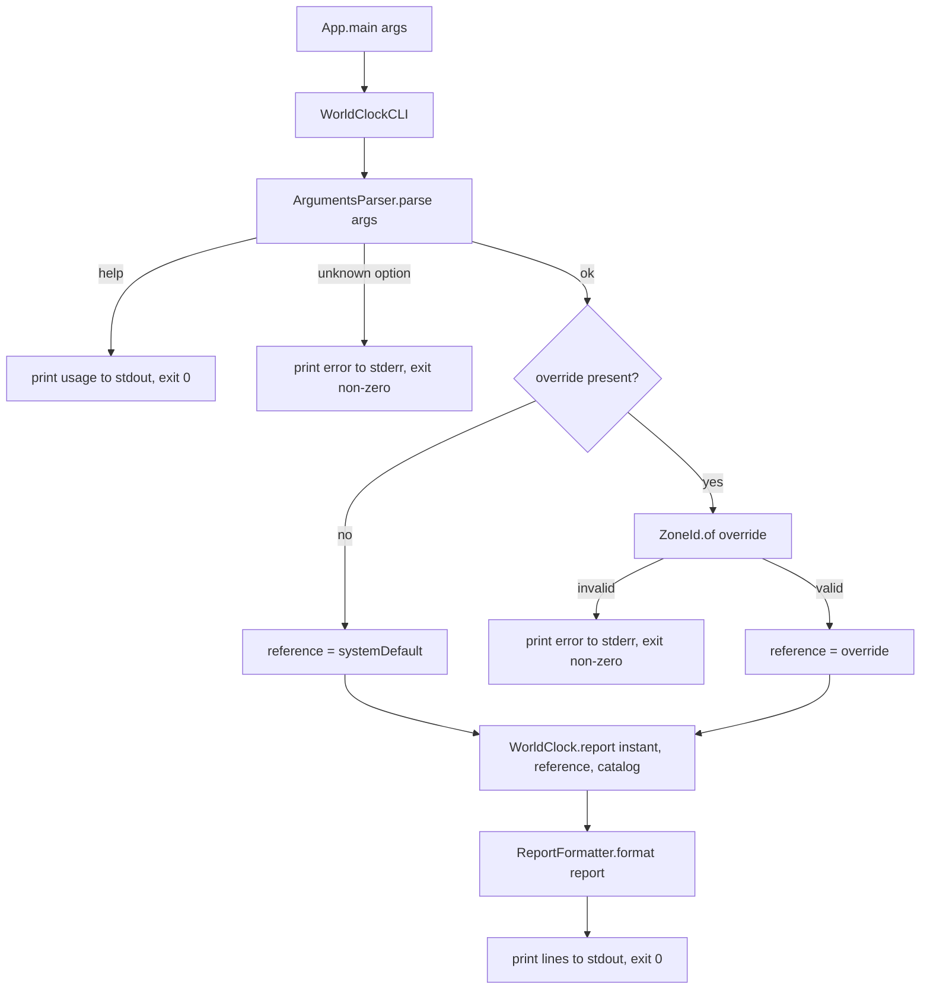

# Design Document

## Overview

World Clock is a zero-dependency Java 25 CLI application that prints the current time across a fixed catalog of major business hubs, anchored to a single reference timezone. By default the reference timezone is the host's system default (`ZoneId.systemDefault()`); the user can override it with a `--timezone <IANA-ID>` option. All hub times and the reference time are derived from one shared `Instant`, so every displayed time represents the same moment. Results go to standard output; errors go to standard error with a non-zero exit code.

The application is stateless and reads no persistent configuration. Its behavior is a pure function of three inputs: the command-line arguments, the current instant, and the system default timezone. This makes the core computation and rendering highly testable in isolation.

Key design decisions:
- **Single instant, many zones.** One `Instant` is captured once and projected into each hub's `ZoneId`. This guarantees consistency across all displayed times and is the central invariant of the system.
- **Injected clock and default zone.** Time and the system default zone are passed in (via `Clock`/`ZoneId`) rather than read from static globals in the core logic, so tests are deterministic.
- **IANA identifiers are validated by the JDK.** `ZoneId.of(...)` is the single source of truth for whether an override is valid; invalid identifiers throw `DateTimeException`, which is translated into a user-facing error and a non-zero exit code.
- **Thin boundary, pure core.** Argument parsing and stream/exit-code handling live at the boundary; time computation and formatting are pure functions with no I/O.

## Architecture

The application follows the Boundary-Control-Entity (BCE) pattern. Feature business components are direct children of the `airhacks` package. `App.java` remains the entry point and delegates immediately to the `cli` boundary.

```
src/main/java/
  airhacks/
    App.java                          # entry point, delegates to cli boundary
    cli/
      boundary/WorldClockCLI.java     # arg dispatch, stdout/stderr, exit codes
      control/ArgumentsParser.java    # parse String[] -> Arguments
      entity/Arguments.java           # parsed CLI arguments (help, override)
    hubs/
      entity/BusinessHub.java         # one hub: display name + ZoneId
      control/HubCatalog.java         # fixed catalog of business hubs
    clock/
      control/WorldClock.java         # compute a ClockReport from instant + zones
      entity/ClockReading.java        # one label + zone + local time
      entity/ClockReport.java         # reference reading + hub readings
    format/
      control/ReportFormatter.java    # ClockReport -> printable lines
```

Responsibilities per business component:
- **cli** — the only component aware of the process environment. Parses arguments, resolves the reference timezone (override or system default), invokes the core, prints results or errors, and selects the exit code.
- **hubs** — owns the fixed `Hub_Catalog` and the `BusinessHub` value type.
- **clock** — pure computation: given an `Instant`, a reference `ZoneId`, and the catalog, produce a `ClockReport`.
- **format** — pure rendering: turn a `ClockReport` into text lines using a 24-hour format.

### Flow



## Components and Interfaces

### airhacks.cli.entity.Arguments
Immutable record describing the parsed command line.
```java
public record Arguments(boolean help, Optional<String> timezoneOverride) {}
```

### airhacks.cli.control.ArgumentsParser
Pure parsing of the raw argument array into `Arguments`, with no I/O.
```java
public interface ArgumentsParser {
    // Recognizes: --help/-h, --timezone <id>/--timezone=<id>
    // Throws UnknownOptionException for unrecognized options
    // Throws MissingValueException when --timezone has no value
    static Arguments parse(String... args);
}
```

### airhacks.cli.boundary.WorldClockCLI
Coarse-grained facade orchestrating a single run. Owns all stream writes and exit-code selection. Accepts an injected `Clock` and system-default `ZoneId` supplier so runs are testable without touching real time.
```java
public interface WorldClockCLI {
    // Returns the process exit code (0 success, non-zero error).
    // Writes results to out, errors and usage-on-error to err.
    static int run(String[] args, Clock clock, ZoneId systemDefault,
                   Appendable out, Appendable err);
}
```

### airhacks.hubs.entity.BusinessHub
```java
public record BusinessHub(String name, ZoneId zone) {}
```

### airhacks.hubs.control.HubCatalog
Owns the fixed catalog of business hubs: New York and Tokyo.
```java
public interface HubCatalog {
    static List<BusinessHub> hubs();
}
```

### airhacks.clock.control.WorldClock
Pure core: projects a single instant into the reference zone and every hub zone.
```java
public interface WorldClock {
    static ClockReport report(Instant instant, ZoneId reference, List<BusinessHub> hubs);
}
```

### airhacks.format.control.ReportFormatter
Pure rendering into 24-hour formatted lines.
```java
public interface ReportFormatter {
    static List<String> format(ClockReport report);
}
```

## Data Models

### Arguments
| Field | Type | Meaning |
|-------|------|---------|
| help | boolean | true when a help option was supplied |
| timezoneOverride | Optional\<String\> | raw override identifier, if supplied |

### BusinessHub
| Field | Type | Meaning |
|-------|------|---------|
| name | String | human-readable hub name (for example "New York") |
| zone | ZoneId | the hub's IANA timezone |

### ClockReading
Represents one row of output: a label, its zone, and the local time at the shared instant.
```java
public record ClockReading(String label, ZoneId zone, ZonedDateTime localTime) {}
```

### ClockReport
The full result of a run.
```java
public record ClockReport(ClockReading reference, List<ClockReading> hubReadings) {
    // Invariant: reference.localTime().toInstant() equals every
    // hubReadings[i].localTime().toInstant()
}
```

The reference reading is labeled with its IANA timezone identifier (`zone.getId()`). Each hub reading is labeled with the hub's display name. All readings share a single underlying `Instant`.

## Correctness Properties

*A property is a characteristic or behavior that should hold true across all valid executions of a system — essentially, a formal statement about what the system should do. Properties serve as the bridge between human-readable specifications and machine-verifiable correctness guarantees.*

The core computation (`WorldClock`), rendering (`ReportFormatter`), reference resolution, and argument handling are pure functions of their inputs, which makes property-based testing a good fit. The properties below are derived from the acceptance criteria and consolidated to remove redundancy.

### Property 1: Single-instant consistency

*For any* instant, *any* reference `ZoneId`, and *any* catalog of business hubs, every reading in the produced `ClockReport` (the reference reading and all hub readings) maps back to that same input `Instant`.

**Validates: Requirements 1.4, 3.2**

### Property 2: Report structure covers every hub correctly

*For any* catalog of business hubs and *any* instant, the `ClockReport` contains exactly one hub reading per catalog entry, and for each entry the reading's zone equals the hub's zone, its local time equals the input instant projected into that zone, and the rendered line contains the hub name and its formatted local time.

**Validates: Requirements 1.1, 1.2**

### Property 3: 24-hour time formatting

*For any* instant and *any* `ZoneId`, the formatted time in each rendered line matches a 24-hour hours-and-minutes format (hours `00`-`23`, minutes `00`-`59`) and equals the local time obtained by projecting that instant into that zone.

**Validates: Requirements 1.3**

### Property 4: Reference timezone resolution

*For any* run, when no timezone override is supplied the report's reference zone equals the injected system default zone, and when a valid IANA override is supplied the report's reference zone equals `ZoneId.of(override)` regardless of the system default.

**Validates: Requirements 2.1, 3.1**

### Property 5: Reference reading is present and IANA-labeled

*For any* run, the report contains a reference reading in addition to the hub readings, and that reference reading is labeled with its IANA timezone identifier (`zone.getId()`), which also appears in the rendered reference line.

**Validates: Requirements 2.2, 2.3**

### Property 6: Invalid input yields an error and a non-zero exit code

*For any* string that is not a valid IANA timezone identifier supplied as an override, and *for any* unrecognized option token, a run writes a non-empty descriptive message to standard error and returns a non-zero exit code without printing a normal report to standard output.

**Validates: Requirements 3.3, 4.2**

### Property 7: Successful run yields a zero exit code

*For any* valid invocation (no help option, no unknown options, and either no override or a valid IANA override), a run writes the report to standard output and returns a zero exit code.

**Validates: Requirements 4.3**

## Error Handling

Errors are handled at the boundary and never as raw stack traces. The core throws typed, meaningful exceptions; the `cli` boundary catches them, writes a concise message to standard error, and selects a non-zero exit code.

| Condition | Detection | Behavior | Exit code |
|-----------|-----------|----------|-----------|
| Invalid `--timezone` value | `ZoneId.of(override)` throws `DateTimeException` | Write `Error: unknown timezone '<value>'. Use an IANA identifier such as Europe/Berlin.` to stderr | non-zero (e.g. 2) |
| Unrecognized option | `ArgumentsParser` throws `UnknownOptionException` | Write `Error: unknown option '<opt>'.` plus a hint to run `--help`, to stderr | non-zero (e.g. 2) |
| `--timezone` without a value | `ArgumentsParser` throws `MissingValueException` | Write `Error: --timezone requires an IANA timezone identifier.` to stderr | non-zero (e.g. 2) |
| Help requested | `Arguments.help()` is true | Write usage text to stdout | 0 |
| Successful display | no exception | Write report to stdout | 0 |

Notes:
- Error messages are descriptive and actionable; they name the offending value and suggest a correction.
- On any error path, no partial report is written to standard output.
- Exit codes are centralized in `WorldClockCLI.run` so the mapping is defined in exactly one place. `App.main` calls `System.exit(code)` with the returned value.

## Testing Strategy

The design uses a dual approach: property-based tests for the universal properties above, and example/unit tests for specific flows and edge cases. The core (`WorldClock`, `ReportFormatter`, `ArgumentsParser`, reference resolution) is pure, so tests inject a fixed `Clock` and system-default `ZoneId` and capture output through `Appendable` buffers rather than the real process streams.

### Property-based testing
- **Library:** jqwik (the standard property-based testing library for Java). Do not implement property generation from scratch. Since the application itself stays zero-dependency (built with `zb`), jqwik is used only as a test-scope dependency, kept out of the shipped `zbo/app.jar`.
- **Iterations:** each property test runs a minimum of 100 generated cases.
- **Generators:**
  - random `Instant` values across a wide epoch range,
  - random `ZoneId` values drawn from `ZoneId.getAvailableZoneIds()` for reference/hub zones,
  - random catalogs (lists of `BusinessHub` with arbitrary names and available zones),
  - random invalid timezone strings (values rejected by `ZoneId.of`) and random unrecognized option tokens for the error-condition property.
- **Tagging:** each property test is tagged with a comment referencing its design property, in the format `Feature: world-clock, Property {number}: {property_text}`.
- **Mapping:** one property-based test per correctness property (Properties 1-7).

### Example and unit tests
Focused, concrete cases that complement the properties:
- `--help` and `-h` print usage mentioning `--timezone` and exit 0 (Requirement 4.1).
- A specific known override (for example `Asia/Tokyo`) produces the expected reference label and a correct sample time.
- `--timezone` supplied with no following value produces the missing-value error and a non-zero exit.
- The default `HubCatalog` is non-empty and contains the expected well-known hubs with valid `ZoneId`s.
- Boundary times around midnight and `23:59` format correctly under the 24-hour formatter (edge cases feeding Property 3).

### Build and run
- Build with `zb` (`zb.sh`), producing `zbo/app.jar`; run with `java -jar zbo/app.jar`.
- No `--enable-preview`; all Java 25 features used are GA.
