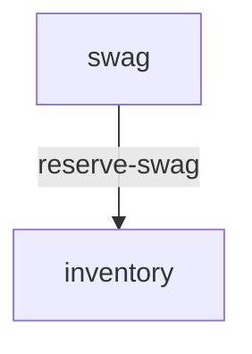

# 👕 airhacks.live Swag

BCE-structured 👉 [bce.design](https://bce.design) | AI-assisted with 👉 [airails.dev](https://airails.dev)

<!-- sbce:generated:start -->
<!-- Projected from the system doc + each BC's package-info spec. Do not hand-edit; regenerate with /sbce. -->

> Collect swag claims from airhacks.live attendees and fulfil them within available stock.

## Business Components

- **[swag](service/src/main/java/airhacks/qmp/swag/package-info.java)** — Accept and confirm one swag claim per airhacks.live attendee.
- **[inventory](service/src/main/java/airhacks/qmp/inventory/package-info.java)** — Track per-size swag stock and reserve it atomically as claims are accepted.

<!-- sbce:generated:end -->

## Getting Started

See [AGENTS.md](AGENTS.md#build--test) for build, dev mode, and system test instructions.

## Modules

- [service](service/README.md) - Quarkus application module with BCE structure
- [service-st](service-st/README.md) - System tests for the service module
