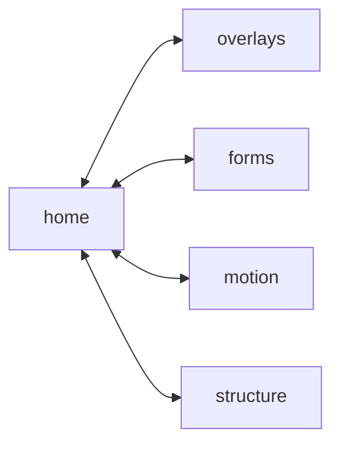

# HTML and CSS Instead of JavaScript

<!-- sbce:generated:start — projection of the specs; do not edit; `apply` regenerates from the system doc + per-BC package docs -->
> A static showcase where every page proves one HTML or CSS feature that replaces SPA JavaScript.

**Vision:** Show that the interactive feel of a single-page application no longer requires JavaScript.

## Capabilities
- **home** — present the catalog of all feature demos and own the site shell — navigation and design tokens · [`spec`](home/package-info.md)
- **overlays** — demonstrate top-layer UI — popovers, modal dialogs, declarative invoker commands, and anchored tooltips — with HTML and CSS only · [`spec`](overlays/package-info.md)
- **forms** — demonstrate form interactivity — validation feedback, auto-growing fields, styled selects — with HTML and CSS only · [`spec`](forms/package-info.md)
- **motion** — demonstrate CSS-driven motion — element continuity across pages, enter/exit animation, scroll-driven effects, carousels — with HTML and CSS only · [`spec`](motion/package-info.md)
- **structure** — demonstrate structural reactivity — parent-state styling, container-adaptive layout, exclusive disclosure — with HTML and CSS only · [`spec`](structure/package-info.md)

## Components

<!-- sbce:generated:end -->

A static site demonstrating recent HTML and CSS additions that replace JavaScript in single-page applications. Each feature gets a dedicated page with a working demo and the minimal markup behind it — no frameworks, no build step, no dependencies.

The browser is absorbing the widget-glue category of JavaScript: toggling, positioning, animating, validating. These pages show how much of a typical SPA now runs on markup and stylesheets alone. What remains for JavaScript is state management and data fetching — the view layer is declarative.

## Feature Pages

Each page demonstrates one feature and states what it replaces.

| Page | Feature | Replaces |
|---|---|---|
| `popover.html` | Popover API | Click-toggle menus, tooltips, toasts; light dismiss and ESC handling |
| `invoker-commands.html` | `command` / `commandfor` | `showModal()` / `togglePopover()` glue code |
| `dialog.html` | `<dialog>` | Modal libraries, focus traps, backdrop handling |
| `accordion.html` | `<details name>` + `::details-content` | Accordion components |
| `has.html` | `:has()` | State classes managed by event listeners |
| `starting-style.html` | `@starting-style` + `transition-behavior` | Enter/exit animation choreography, `transitionend` handling |
| `view-transitions.html` | View Transitions | Route-change animation code |
| `form-validation.html` | `:user-valid` / `:user-invalid` | Form validation libraries |
| `field-sizing.html` | `field-sizing: content` | Auto-growing textarea scripts |
| `anchor-positioning.html` | Anchor positioning | Floating UI / Popper |
| `scroll-driven.html` | Scroll-driven animations | Scroll listeners, IntersectionObserver reveal effects |
| `carousel.html` | `::scroll-button()` / `::scroll-marker` | Carousel components |
| `custom-select.html` | Customizable `<select>` | Custom dropdown components |
| `container-queries.html` | Container queries | ResizeObserver layout switching |

Features with Baseline Limited availability (anchor positioning, scroll-driven animations, CSS carousels, customizable `<select>`) are demos of what is coming — the page states the support status and degrades gracefully.

## Support floor

This is a demo (`web-latest` — the Baseline gate is lifted), not a production site. Below-Widely features in use:

| Feature | Status | Runs in |
|---|---|---|
| Popover API, invoker commands, `@starting-style`, `light-dark()`, `field-sizing`, `<details name>`, `::details-content` | Newly available | all evergreen browsers (invoker commands: Chrome 135+, Safari 18.4+, Firefox 144+) |
| Cross-document view transitions | Limited | Chrome/Edge 126+ |
| Anchor positioning | Limited | Chrome/Edge 125+ |
| Scroll-driven animations | Limited | Chrome/Edge 115+, Firefox behind `layout.css.scroll-driven-animations.enabled` |
| `::scroll-button` / `::scroll-marker` (carousel) | Limited | Chrome/Edge 135+ |
| Customizable `<select>` | Limited | Chrome/Edge 135+ |
| `interpolate-size` | Limited | Chrome/Edge 129+ |

Every Limited feature degrades gracefully: navigation stays instant, tooltips still render, the carousel scrolls and snaps, the select falls back to native.

## Run

Serve the folder with [zws](https://github.com/AdamBien/zws), the zero-dependency static file server (or any other):

```
zws
```

Open `http://localhost:3000` — the index links every feature page.

## Conventions

Semantic HTML, custom-property design tokens, dark and light theme via `light-dark()`. JavaScript appears only where a feature requires an imperative trigger, and each page marks it explicitly.

---

Built with [sbce.dev](https://sbce.dev) / [airails.dev](https://airails.dev).

powered by [airhacks.industries](https://airhacks.industries)